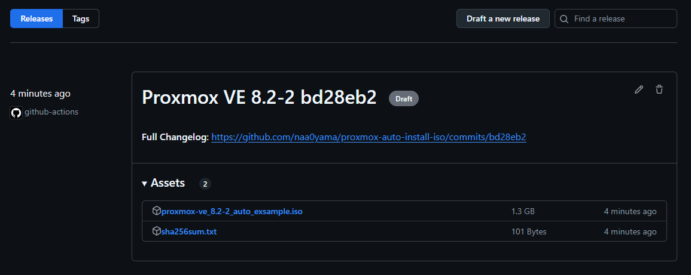

# proxmox-auto-install-iso
Create an automated installation ISO for Proxmox VE

1. Store the answer files under the `answers` directory.
2. When you run a `local build` or GitHub Actions Dispatch, an ISO will be created and registered as a Draft in the Release.

The `answers` directory supports multiple file placements, so you can create an ISO by placing as many files as you need.

## use

Please refer to [here](.github/workflows/release.yml) for usage